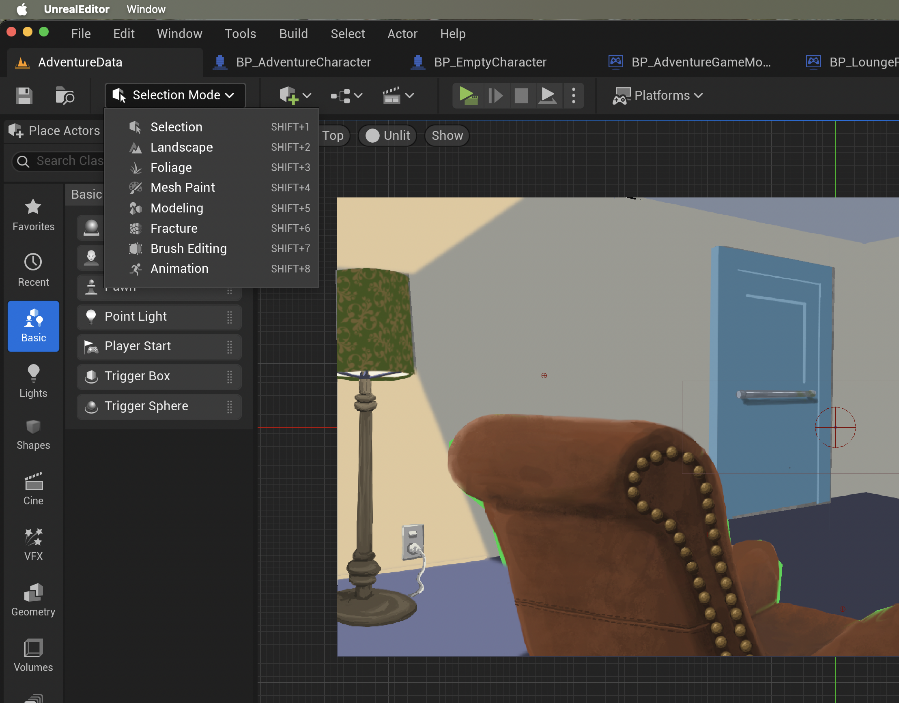
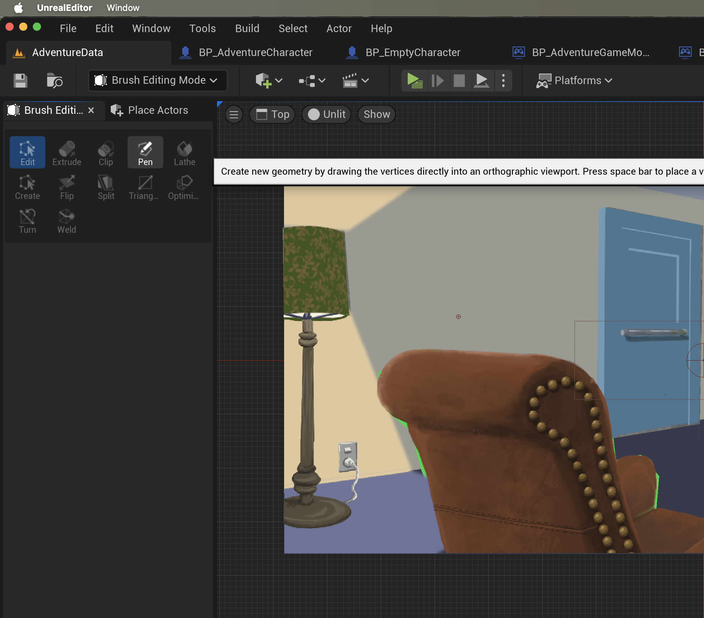
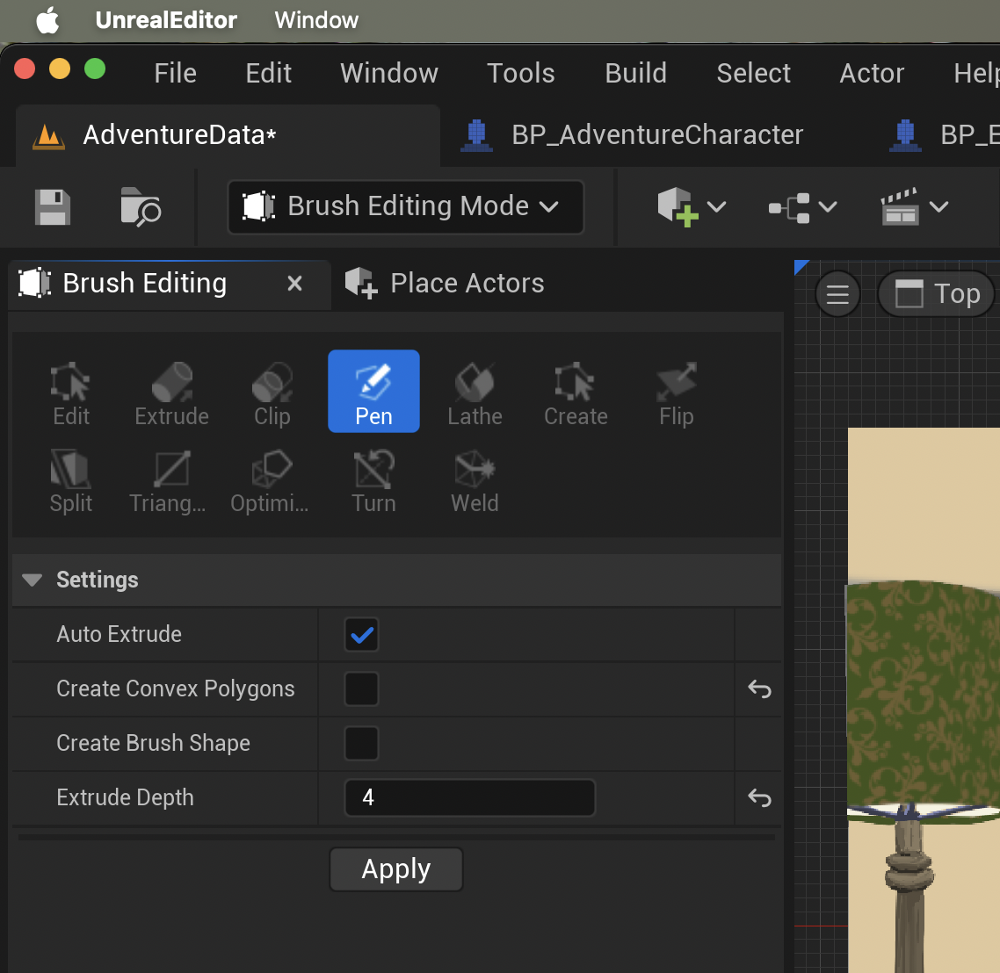
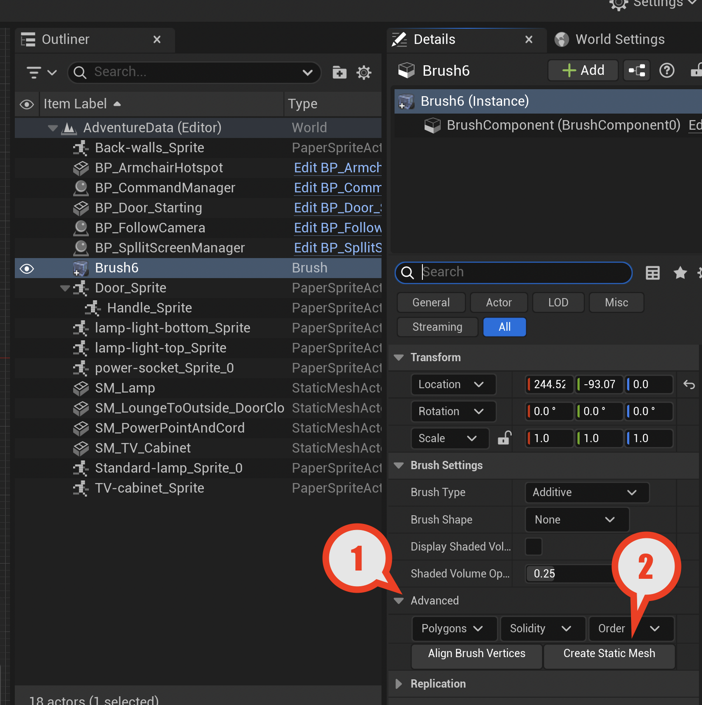
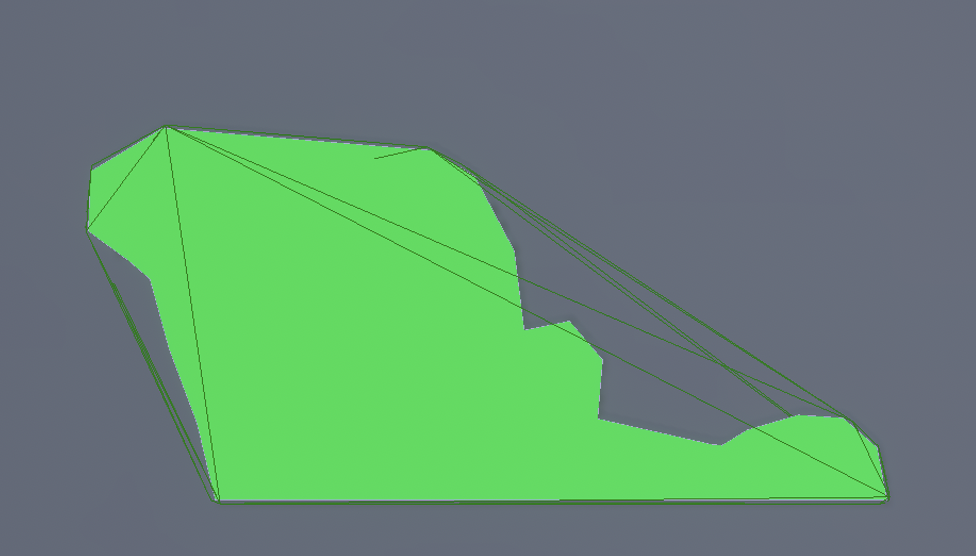
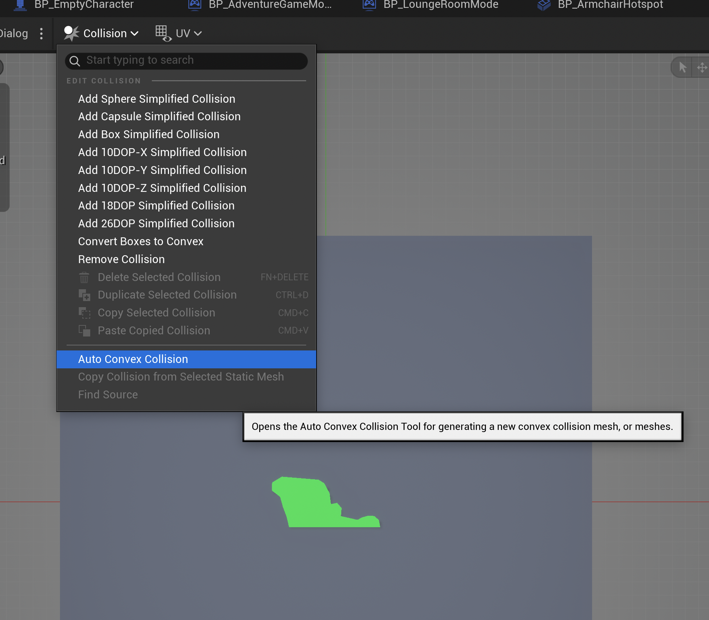
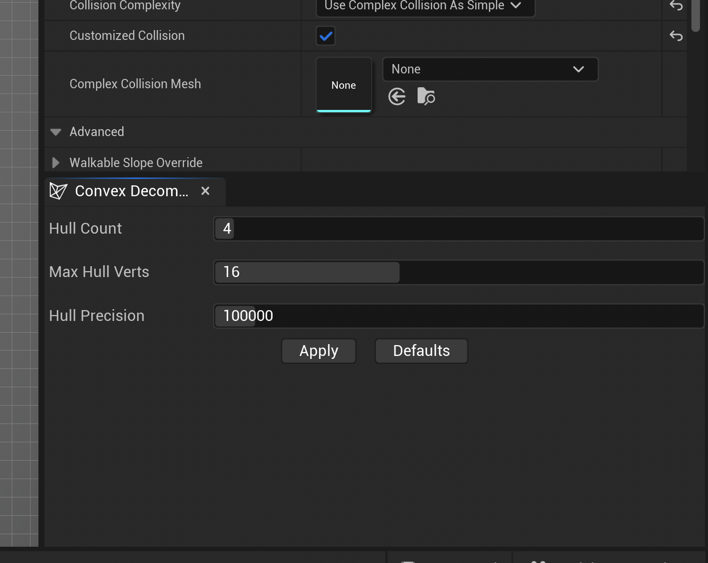
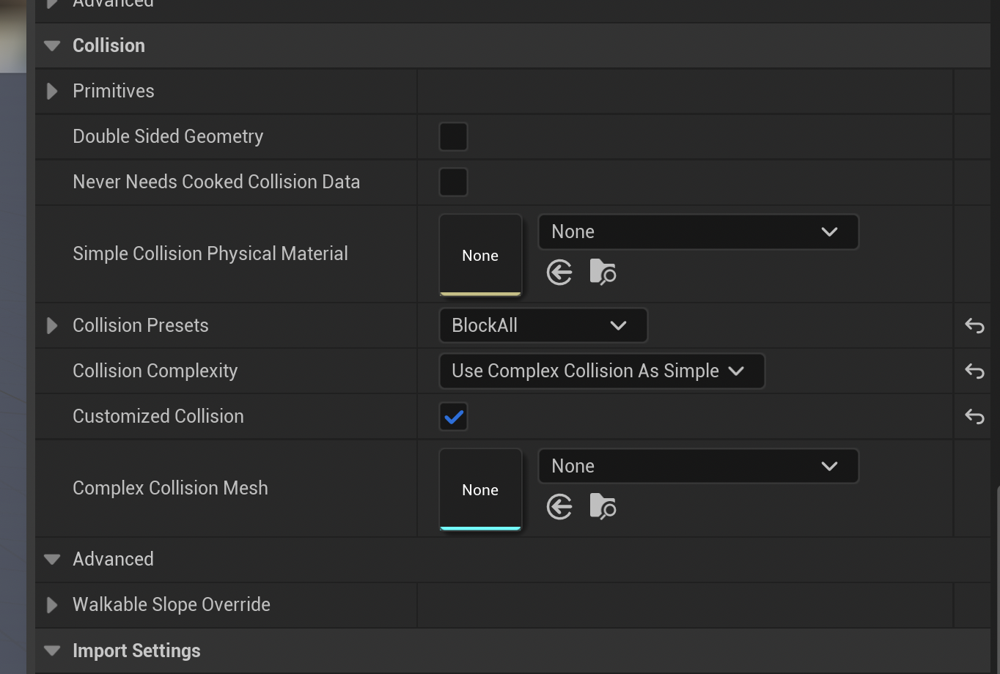

# How to Create a HotSpot

Anything that can be interacted with in the game (but which does not appear in the inventory UI) is a HotSpot.

The base class for this is `AHotSpot` in the file `Source/AdventureGame/HotSpots/HotSpot.h`.

This guide shows how to create the hotspots to build a game called "Coming Home" where there
is a "Lounge Room" level that has an "Armchair" hotspot in it.

## 1. Choose the Right Type

The simplest `AHotSpot` is a part of the scene background image that you want the player to be able to tap
on and try verbs on such as "Look At". In this case you can supply a long and short description which will
automatically be used.

If an object is to be picked up off the ground and added to the inventory, you need two representations of it:
one is the HotSpot for the object to be picked up; and the other is the object as it appears in the inventory.
For this you need `APickUp` which has a sprite that can be hidden.

* `AHotSpot` 
    - basic type
    - has a shape that covers part of the environment 
    - like a bush or a painting on the wall (no need for its own sprite)
* `APickUp` 
    - derives from <b>HotSpot</b>
    - represents an object in the scene
    - with its own sprite, and
    - can usually interact to add to the player inventory
    - when picked up can hide the in-scene representation
* `ADoor` 
    - derives from <b>PickUp</b> 
    - allows a player character to move to another room or level
    - has open/closed/locked states
    - can hide the sprite to represent the open state
    - or customise via Blueprint for sliding or animated doors
* `AHotSpotNPC` 
    - derives from <b>HotSpot</b> but has a PaperFlipBook animation
    - represents a thing in the scene that can be interacted with via dialogues
    - responds to the <b>TalkTo</b> verb and shows the players available prompts to say

## 2. Select or Position Sprites

For the base HotSpot you can just use a feature of the scene background. 

If you want to use a seperate sprite artwork:

* drag it into Unreal
* right-click, apply Paper2D settings
* right-click and create or extract a sprite
* drag the sprite into the scene 

## 3. Create a Brush Shape

The Hotspot will consist of a visual part, a collision mesh for detecting when the play clicks on it, 
and a behaviour set. To create the collision mesh we use the brush tool in the viewport.

* Ensure the view mode is "Top" (not Perspective) and the rendering in the editor is unlit
* Ensure the artwork is visible in the viewport - either a sprite, or just the environment / background
* Click the dropdown for the editing mode and switch to <b>Brush Editing Mode</b>.

We use the "Pen" tool which works by clicking with the mouse and space bar to create joined edges around the edges of a complex shape and then closing that by pressing enter.

* Choose "pen" and make the settings "Auto extrude: true" 
* Extrude depth 4 - the rest leave unchecked

* Click apply 
* Move the mouse into the editor area, and click once to get focus
* Then move the mouse to a position on the edge of your feature or sprite
* Press the space bar to create a point there
* Move the mouse again, press the space bar again
* Repeat until the whole shape is outlined except for the last connection
* Press enter to close the shape

## 4. Convert the Brush to a Mesh

The brush created in the previous step should appear in the scene, aligned
with your artwork. In my images I have a green mesh and an armchair sprite. The brush
will be grey not green, but at this point convert the brush to a mesh by opening the
advanced panel and clicking the convert to static mesh button.

* Click <b>Create Static Mesh</b>

When this button is clicked, you get a dialog to save the mesh object in your games content. Save it to the meshes folder. Use `SM_` prefix for all static meshes. Its also a good idea for any non-trivial game to have a folder in there for each room:

* `Content/PointAndClick/Meshes/Lounge/SM_Armchair`

After you save the mesh, the brush will be gone from the scene and will be replaced by a static mesh, linked to the place you saved it.

## 5. Set up the Mesh for the Game

Navigate to where the mesh was saved and double-click to open it. We need to set a bright
material onto it so that we can tell if the mesh is visible - we don't want it to be. And 
also to help check for any problems with it not lining up to the sprite.

Under the material settings for the mesh choose <b>M_PosterHotSpot</b> which is bright green.

Choose <b>Top</b> in the viewport and confirm the mesh is the correct shape. Now we set up
the collisions for the mesh. For the case of a chair it has a "re-entrant" shape, so its 
important to do this correctly. For some other mesh objects that are more square or round
(so-called convex) objects it does not matter so much.

* Click the "Collision" menu option at the top tool bar
* Choose the "Auto Convex Collision" option

* A tool dialog pops up at the bottom right on the details panel:

* On the tool dialog click "Apply" and dismiss the dialog.
* Now on the mesh "Collision" section of the details panel choose as follows:

* Collision complexity: Use complex collision as simple

There is a good explanation of what this is doing [on the Unreal website](https://dev.epicgames.com/documentation/en-us/unreal-engine/simple-versus-complex-collision-in-unreal-engine?application_version=5.5) but basically for physics bodies in an unreal scene you can have two different collision shapes: a complex set and a simple set. Its cheaper performance-wise to use
the simple queries (such as did this click or tap hit an object) than the complex queries.

However for complex shapes like the chair a simple convex hull (as though a bed-sheet was wrapped
over it) would be bad because you would miss objects that could be seen behind the shape. So for this reason generally use this setting.

## 6. Create the HotSpot

Right click in the HotSpot folder and create a new Blueprint, inheriting from the class chosen in item 1 above. Name it eg `BP_Armchair` or `BP_HotSpot_Armchair` if there is a need to distinguish from an item of that name.

Open the blueprint up and set the mesh created in step 5 as the static mesh.

* Static Mesh: SM_Armchair

If there is a seperate sprite for the HotSpot then choose that in the sprite drop down.

* Sprite: Armchair sprite (or flipbook)

Confirm that the mesh visibility under <b>Rendering</b> in the details panel is set to 
hidden in game. If the green mesh is annoying, once you have it all set up in the editor
you can also turn visibility off altogether for the mesh. Its handy to have it on in case
the mesh and the sprite get misaligned during the editing process.

## 7. Add the HotSpot in the Scene

Drag the hotspot from the content browser into the scene. Delete the mesh that was in the scene
and the sprite (if added) make sure not to delete the new hotspot.

Set the Z position and perhaps the translucent sort priority (or both) to ensure the hotspot is 
correctly being overlapped by or is overlapping any other items as you expect.

## 8. Customise the locations for the Hotspot

* In the scene outline select the new hotspot, and then the <b>Walk to Position</b>
    - This is a player detector sphere used to position when the player goes to 
    - If a verb is used on the hotspot and an adventure character is in the scene
    - It will walk to that position before interacting with the hotspot
* For an NPC, also in the scene outline select the new hotspot, and then the <b>Bark Position</b>
    - This is where the speech responses for the NPC will appear
    - This also works for inanimate objects like a TV set or answering machine that puts out speech

## 9. Create Text for the new Hotspot

- Create a new string table if there is not one already
    - Right click in `Content/PointAndClick/Data`
    - Choose `Miscellaneous > String Table` from the menu
    - Save the String Table as `ST_ComingHome` or whatever the game 
- Create two entries in the string table - for example
    - Key: `Armchair_HotSpot_ShortDescription`
    - Source string: `tatty armchair`
    - Key: `Armchair_HotSpot_LongDescription`
    - Source string: `So dusty\nHas this ever been cleaned?\nNot sitting there`
- For the long description you can use `\n` to add line breaks
    - When the look at is rendered these will be shown as seperate lines.

## 10. Test it out by running the game

- Run the game, and hover the mouse over the hotspot
- The short description should show in the interaction UI eg "Walk to tatty armchair"
- The adventure character should be able to look at the hotspot 
- They will walk up to it, and bark the long description