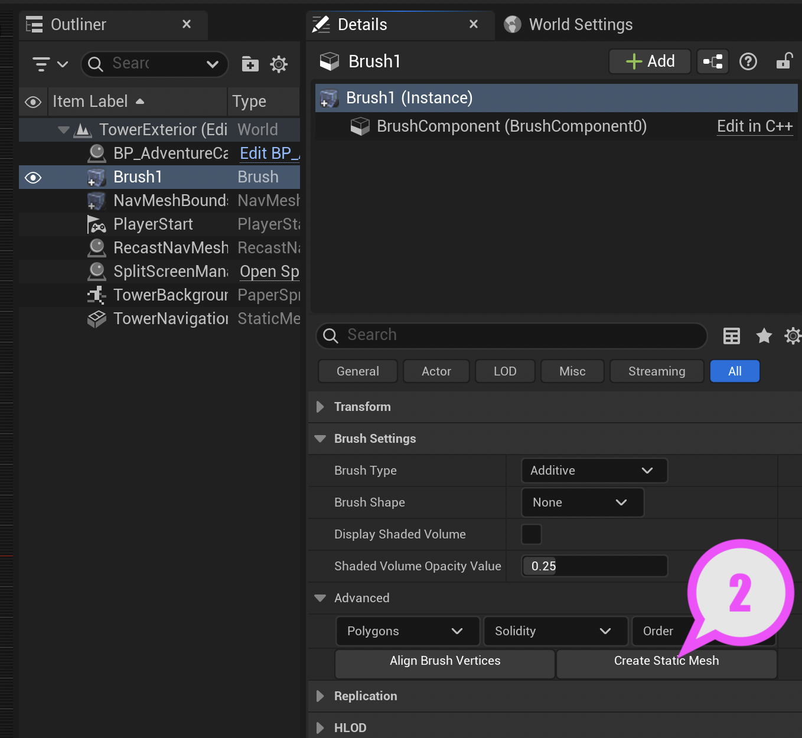
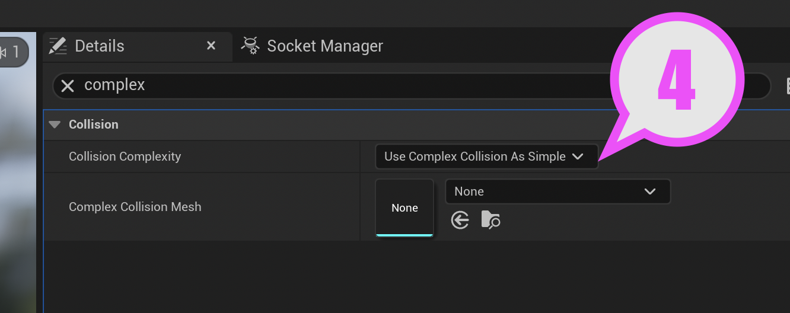

## Nav Mesh Problems

* I had a lot of problems with generating and having my nav mesh show up
* This comment from [@sentinel2952](https:www.youtube.com/@sentinel2592) helped me track down the solution:

> If you are in ue5 (I'm in 5.4) and having trouble generating the navmesh from the brush at the end, 
> you can save the brush as a static mesh, then open the new static mesh asset and generate collisions 
> and then set the collision complexity to "use complex as simple".

* Activate brush-editing mode - use Return or Enter to close the shape.
* Do not add a Nav bounds volume at this time

* Select the brush in the hierarchy / scene outliner and in the detail panel click _Create Static Mesh_

* Locate the mesh you created in the previous step, double-click to open in a new editor tab
* Select _Auto Convex Collision_ from the Collision menu to generate a collision mesh

* Change this drop-down in the details panel in the static mesh editor tab to _Use Complex Collision as Simple_

* After this go back to the main editor window, and add the Nav Bounds volume, and continue as per Lesser Dogs instructions

## Player Character Falling

At the end of the first episode on running the project with the player character it fell constantly. What that looks like is the game starts, the character disappears but is visible in the _Outliner_ (the list of all objects in the scene). Clicking on the character in the outliner and expanding the Transform you can see in the Z direction its rapidly and constantly changing. The character has fallen through the floor. In 
my case the fix for this is:

* change from top to side view (eg "right") 
* make sure the character mesh/start point is above the red line of the background image
* make sure the character is inside the nav mesh bounds

## Object Lifecycle

Unreal Engine uses a [garbage collection system] to manage memory for UObject-derived classes.
The engine automatically tracks references to UObjects and collects them when they are no
longer needed.

Always use the `UPROPERTY` macro for UObject references to ensure proper garbage collection.
This helps the engine keep track of references and prevents premature destruction.

Note: I did try using a Pimpl idiom but that does not work with classes that are
exposed to Blueprints, as far as I can tell. Because those Blueprint exposed classes
have to be UObjects and have the destructor automatically generated.

[garbage collection system]:  https:medium.com/@lemapp09/learning-unreal-managing-object-lifecycles-in-unreal-engine-fa79ba9bb51c

## State Management

I had a lot of issues trying to manage the player command state.  I spent several weeks 
trying different ways to create a state machine to handle the complexity, but in the end
wound up using Justin's approach of enums and booleans, pretty much - although mine is in
C++ classes. 

* See [Command State](./CommandState.md)

Maybe use this in future - UE5 State Trees

https:dev.epicgames.com/community/learning/tutorials/Dd0L/unreal-engine-environmental-storytelling-npc-action-sequencer
